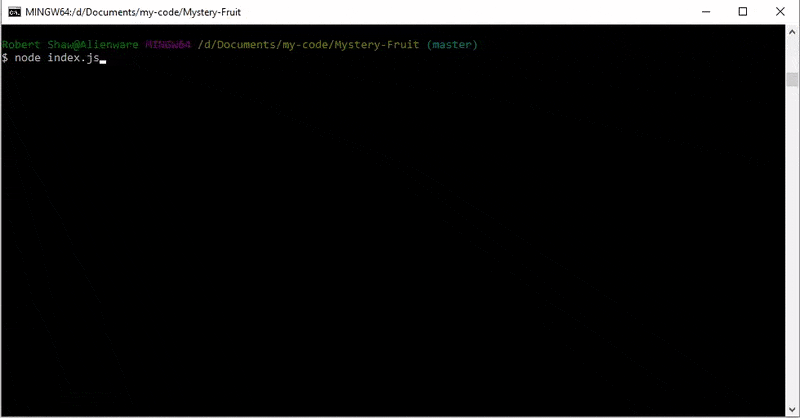

# Mystery-Fruit
My word guess game re-imagined in Node. Now with 100% more fruit!

## Getting Started

Download the repository. Then, navigate to the folder and run install from your node package manager. If everything is installed, when you run `index.js`, you should get a screen like this:



Just follow the on screen instructions to start discovering the mystery fruit! How many can you get right?

### Prerequisites

You must have node installed in your terminal with support for the Node Package Manager.

### Installing

[Node.js Website](https://nodejs.org/en/)

Navigate to the Node.js website and follow the instructions to install Node. Then navigate to the project folder in your terminal.
```
/.../Mystery-Fruit/
```

Within that folder, run
```
npm install
```

Now, you're ready to play! Just run
```
node index.js
```


## Built With

* [Javascript](https://www.javascript.com/) - The scripting language used

* [Node.js](https://nodejs.org/en/) - JavaScript runtime

* [Node File System](https://nodejs.org/api/fs.html) - Interact with the file system

* [Node Package Manager](https://www.npmjs.com/) - Package manager for JavaScript and Node

* [Inquirer](https://www.npmjs.com/package/inquirer) - Command line user interface

## Challenges


## Authors

* **Robert Shaw** - *Initial work* - [robertshaw87](https://github.com/robertshaw87)